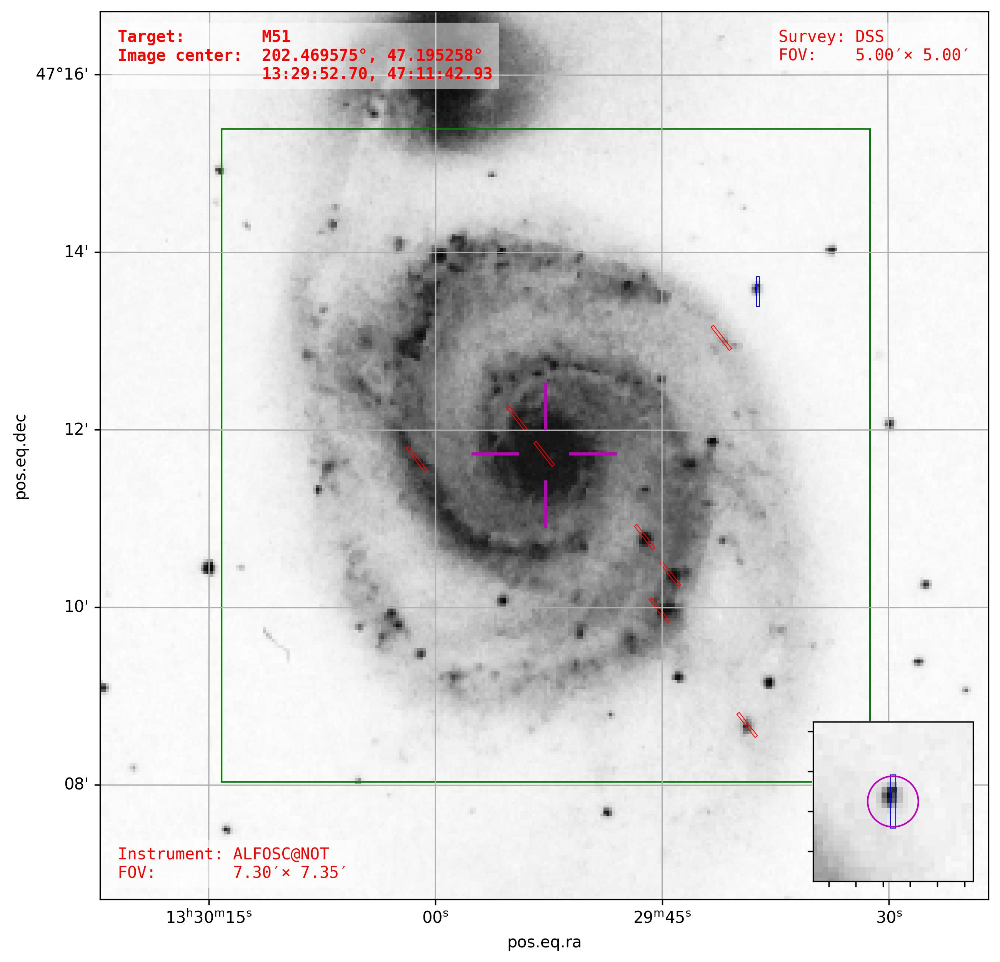

# finder_charts

Creating finder charts using SkyView. Supports showing of *slits* and *instrument FOV*.

See Example.ipynb for how to create finder charts.

Created using astroplan and  https://github.com/Astro-Sean/finder_chart.

Dependencies: `astropy`, `astroplan`, `astroquery`, `matplotlib`, `numpy`

Tested on:
`Python` 3.12.2,
`astropy` 7.1.0,
`astroplan` 0.10.1,
`astroquery` 0.4.11,
`matplotlib` 3.10.3,
`numpy` 1.26.4

